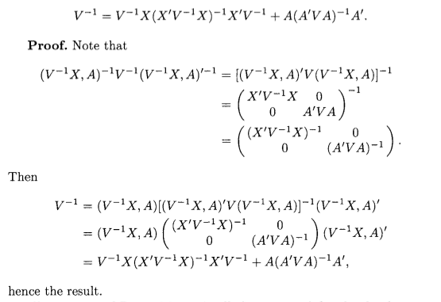

```{r setup, include=FALSE}
knitr::opts_chunk$set(echo = TRUE, warning = FALSE, fig.align='center')
```

# Introduction

When I was a master student in Temple University, I spent a lot of time struggling with linear mixed model. Particularly, ML and REML estimation for linear mixed model has confused me for long time. So I decided to write this webpage as a time saver for students who are not familiar with this topic.

# Matrix Notation

\begin{equation}
\boldsymbol{Y} = \boldsymbol{X\beta} + \boldsymbol{Zu} + \boldsymbol{e}
(\#eq:Matrix-Notation1)
\end{equation}

\begin{equation}
\begin{pmatrix}
\boldsymbol{u}\\
\boldsymbol{e}
\end{pmatrix} \sim \mathcal{N}
\begin{pmatrix}
\begin{pmatrix}
\boldsymbol{0}\\
\boldsymbol{0}
\end{pmatrix},
\begin{pmatrix}
\boldsymbol{G} & \boldsymbol{0}\\
\boldsymbol{0} & \boldsymbol{R}
\end{pmatrix}
\end{pmatrix}
(\#eq:Matrix-Notation2)
\end{equation}

$\boldsymbol{X}$ and $\boldsymbol{Z}$ are [design matrix](https://en.wikipedia.org/wiki/Design_matrix).

$\boldsymbol{\beta}$ is fix effect vector.

$\boldsymbol{u}$ is random effect vector.

For given $\boldsymbol{u}$ (consider $\boldsymbol{u}$ as constant vector),

\begin{equation}
\boldsymbol{Y} | \boldsymbol{u} \sim \mathcal{N} (\boldsymbol{X\beta} +  \boldsymbol{Zu}, \boldsymbol{R})
(\#eq:y-conditional-distribution)
\end{equation}

The distribution of $\boldsymbol{y}$ is (recall: Var$(\boldsymbol{AX}+\boldsymbol{a}) = \boldsymbol{A}\text{var}(\boldsymbol{X})\boldsymbol{A}^{T}$ )

\begin{equation}
\boldsymbol{Y} \sim \mathcal{N} (\boldsymbol{X\beta}, \boldsymbol{ZG}\boldsymbol{Z}^{T} + \boldsymbol{R})
(\#eq:y-distribution)
\end{equation}

For convenience, we define

\begin{equation}
\boldsymbol{V} = \boldsymbol{ZGZ}^T + \boldsymbol{R}
(\#eq:V)
\end{equation}

# Mixed Model Equations for known $\boldsymbol{V}$

Recall that for $\boldsymbol{y} = (y_1,y_2,\dots,y_n)^T \sim \mathcal{N}(\boldsymbol{\mu},\boldsymbol{\Sigma}_y)$, the probability density function(PDF) is 

\begin{equation}
P(\boldsymbol{y})
= (2\pi)^{-\frac{n}{2}} |\boldsymbol{\Sigma}_y|^{-\frac{1}{2}} \text{exp}[-\frac{1}{2}(\boldsymbol{y} - \boldsymbol{\mu})^{T}\boldsymbol{\Sigma}_y^{-1}(\boldsymbol{y} - \boldsymbol{\mu})]
(\#eq:multivariate-normal-distribution) 
\end{equation}

Combine equation \@ref(eq:Matrix-Notation2) and equation \@ref(eq:multivariate-normal-distribution), we have

\begin{equation}
\begin{split}
P\boldsymbol{\begin{pmatrix}
u\\
\boldsymbol{e}
\end{pmatrix}} &= (2\pi)^{-\frac{n+g}{2}} \boldsymbol{\begin{vmatrix}
\boldsymbol{G} & \boldsymbol{0}\\
\boldsymbol{0} & \boldsymbol{R}
\end{vmatrix}}^{-1}
\text{exp}[-\frac{1}{2}\boldsymbol{\begin{pmatrix}
u\\
\boldsymbol{e}
\end{pmatrix}}^{T}\boldsymbol{\begin{pmatrix}
\boldsymbol{G} & \boldsymbol{0}\\
\boldsymbol{0} & \boldsymbol{R}
\end{pmatrix}}^{-1}\boldsymbol{\begin{pmatrix}
u\\
\boldsymbol{e}
\end{pmatrix}}] \\
&= (2\pi)^{-\frac{n+g}{2}} \boldsymbol{\begin{vmatrix}
\boldsymbol{G} & \boldsymbol{0}\\
\boldsymbol{0} & \boldsymbol{R}
\end{vmatrix}}^{-1}
\text{exp}[-\frac{1}{2}\boldsymbol{\begin{pmatrix}
u\\
\boldsymbol{e}
\end{pmatrix}}^{T}\boldsymbol{\begin{pmatrix}
\boldsymbol{G}^{-1} & \boldsymbol{0}\\
\boldsymbol{0} & \boldsymbol{R}^{-1}
\end{pmatrix}}\boldsymbol{\begin{pmatrix}
u\\
\boldsymbol{e}
\end{pmatrix}}]
\end{split}
(\#eq:likelihood)
\end{equation}

where $g$ is the number of element of random vector $\boldsymbol{u}$

Since $\boldsymbol{V}$ is known(implies that $\boldsymbol{G} \text{ and } \boldsymbol{Q}$ is known), equation \@ref(eq:likelihood) depends on $\boldsymbol{e}$ and $\boldsymbol{u}$. 

Maximise $P\boldsymbol{\begin{pmatrix}
u\\
\boldsymbol{e}
\end{pmatrix}}$ is equivalent to minimize

\begin{equation}
Q(\boldsymbol{u}, \boldsymbol{e}) = \boldsymbol{\begin{pmatrix}
u\\
\boldsymbol{e}
\end{pmatrix}}^{T}\boldsymbol{\begin{pmatrix}
\boldsymbol{G}^{-1} & \boldsymbol{0}\\
\boldsymbol{0} & \boldsymbol{R}^{-1}
\end{pmatrix}}\boldsymbol{\begin{pmatrix}
u\\
\boldsymbol{e}
\end{pmatrix}} = \boldsymbol{u}^T\boldsymbol{G}^{-1}\boldsymbol{u} + \boldsymbol{e}^T\boldsymbol{R}^{-1}\boldsymbol{e}
(\#eq:Q)
\end{equation}

Note that $\boldsymbol{e} = \boldsymbol{e}(\boldsymbol{\beta},\boldsymbol{u}) = \boldsymbol{Y} - \boldsymbol{X\beta} - \boldsymbol{Zu}$

Using results from [Matrix Caculus][Matrix Caculus], we have

\begin{equation}
\frac{\partial \boldsymbol{e} }{\partial \boldsymbol{\beta}} = - \boldsymbol{X}^T
(\#eq:mixed-equation1)
\end{equation}

\begin{equation}
\frac{\partial \boldsymbol{e} }{\partial \boldsymbol{u}} = - \boldsymbol{Z}^T
(\#eq:mixed-equation2)
\end{equation}

Based on equations \@ref(eq:Q), \@ref(eq:mixed-equation1) and \@ref(eq:mixed-equation2), we have (don't forget chain rule from [matrix caculus][Matrix Caculus])

\begin{equation}
\begin{split}
\frac{\partial Q}{\partial \boldsymbol{\beta}} &= \frac{\partial (\boldsymbol{u}^T\boldsymbol{G}^{-1}\boldsymbol{u})}{\partial \boldsymbol{\beta}} + \frac{\partial \boldsymbol{e}}{\partial \boldsymbol{\beta}} 
\frac{\partial (\boldsymbol{e}^T\boldsymbol{R}^{-1}\boldsymbol{e})}{\partial \boldsymbol{e}} \\
& = - 2\boldsymbol{X}^T \boldsymbol{R}^{-1}\boldsymbol{e}
\end{split}
(\#eq:mixed-equation3)
\end{equation}

Similarly, we have 

\begin{equation}
\begin{split}
\frac{\partial Q}{\partial \boldsymbol{u}} &= \frac{\partial (\boldsymbol{u}^T\boldsymbol{G}^{-1}\boldsymbol{u})}{\partial \boldsymbol{u}} + \frac{\partial \boldsymbol{e}}{\partial \boldsymbol{u}} 
\frac{\partial (\boldsymbol{e}^T\boldsymbol{R}^{-1}\boldsymbol{e})}{\partial \boldsymbol{e}} \\
& = 2\boldsymbol{G}^{-1}\boldsymbol{u}  - 2\boldsymbol{Z}^T \boldsymbol{R}^{-1}\boldsymbol{e}
\end{split}
(\#eq:mixed-equation3)
\end{equation}

Setting $\frac{\partial Q}{\partial \boldsymbol{\beta}}$ and $\frac{\partial Q}{\partial \boldsymbol{u}}$ to be $\boldsymbol{0}$ and replacing $\boldsymbol{e}$ with $\boldsymbol{e} = \boldsymbol{Y} - \boldsymbol{X\beta} - \boldsymbol{Zu}$, we have

\begin{equation}
\begin{split}
\frac{\partial Q}{\partial \boldsymbol{\beta}} = \boldsymbol{0}
\Leftrightarrow
\boldsymbol{X}^T \boldsymbol{R}^{-1} \boldsymbol{X}\tilde{\boldsymbol{\beta}} + \boldsymbol{X}^T \boldsymbol{R}^{-1} \boldsymbol{Z}\tilde{\boldsymbol{u}} = \boldsymbol{X}^T \boldsymbol{R}^{-1} \boldsymbol{Y}
\end{split}
(\#eq:mixed-equation4)
\end{equation}

\begin{equation}
\begin{split}
\frac{\partial Q}{\partial \boldsymbol{u}} = \boldsymbol{0}
\Leftrightarrow
\boldsymbol{Z}^T \boldsymbol{R}^{-1} \boldsymbol{X}\tilde{\boldsymbol{\beta}} + 

(\boldsymbol{Z}^T \boldsymbol{R}^{-1} \boldsymbol{Z} +
\boldsymbol{G}^{-1})  \tilde{\boldsymbol{u}} = 

\boldsymbol{Z}^T \boldsymbol{R}^{-1} \boldsymbol{Y}
\end{split}
(\#eq:mixed-equation5)
\end{equation}

Organizing equations \@ref(eq:mixed-equation4) and \@ref(eq:mixed-equation5), we have famous Henderson’s mixed-model equations in matrix form.

\begin{equation}
\begin{bmatrix}
\boldsymbol{X}^T \boldsymbol{R}^{-1} \boldsymbol{X} &
\boldsymbol{X}^T \boldsymbol{R}^{-1} \boldsymbol{Z}\\
\boldsymbol{Z}^T \boldsymbol{R}^{-1} \boldsymbol{X} &
\boldsymbol{Z}^T \boldsymbol{R}^{-1} \boldsymbol{Z} +
\boldsymbol{G}^{-1}
\end{bmatrix}

\begin{bmatrix}
\tilde{\boldsymbol{\beta}}\\
\tilde{\boldsymbol{u}}
\end{bmatrix}

=

\begin{bmatrix}
\boldsymbol{X}^T \boldsymbol{R}^{-1} \boldsymbol{Y}\\
\boldsymbol{Z}^T \boldsymbol{R}^{-1} \boldsymbol{Y}
\end{bmatrix}
(\#eq:mixed-equation5)
\end{equation}

Solution of \@ref(eq:mixed-equation5) is

\begin{equation}
\begin{split}

\begin{bmatrix}
\tilde{\boldsymbol{\beta}}\\
\tilde{\boldsymbol{u}}
\end{bmatrix}

&=

\begin{bmatrix}
(\boldsymbol{X}^T\boldsymbol{V}^{-1}\boldsymbol{X})^{-1}\boldsymbol{X}^{T}\boldsymbol{V}^{-1}\boldsymbol{Y} \\
\boldsymbol{GZ}^T\boldsymbol{V}^{-1}(\boldsymbol{Y} - \boldsymbol{X}(\boldsymbol{X}^T\boldsymbol{V}^{-1}\boldsymbol{X})^{-1}\boldsymbol{X}^T\boldsymbol{V}^{-1}\boldsymbol{Y})
\end{bmatrix}

\end{split}
(\#eq:mixed-equation6)
\end{equation}

Henderson and his PHD student, S.R. Sealer has proved why \@ref(eq:mixed-equation6) is true in @Henderson1959 and @Henderson1963. In next [section][Proof of equation \@ref(eq:mixed-equation6)], I show this important proof step by step.

# Proof of equation \@ref(eq:mixed-equation6)

Equation \@ref(eq:mixed-equation5) is equivalent to \@ref(eq:solution-proof-1) and \@ref(eq:solution-proof-2)

\begin{equation}
\boldsymbol{X}^T \boldsymbol{R}^{-1} \boldsymbol{X} \tilde{\boldsymbol{\beta}} + 
\boldsymbol{X}^T \boldsymbol{R}^{-1} \boldsymbol{Z} \tilde{\boldsymbol{u}} = 
\boldsymbol{X}^T \boldsymbol{R}^{-1} \boldsymbol{Y} 

(\#eq:solution-proof-1)
\end{equation}

\begin{equation}
\boldsymbol{Z}^T \boldsymbol{R}^{-1} \boldsymbol{X} \tilde{\boldsymbol{\beta}} +
(\boldsymbol{Z}^T \boldsymbol{R}^{-1} \boldsymbol{Z} +
\boldsymbol{G}^{-1}) \tilde{\boldsymbol{u}} = \boldsymbol{Z}^T \boldsymbol{R}^{-1} \boldsymbol{Y}

(\#eq:solution-proof-2)
\end{equation}

Because $\boldsymbol{R}$ is positive definite and $\boldsymbol{Z}$ has independent columns, $\boldsymbol{Z}^{T}\boldsymbol{R}^{-1}\boldsymbol{Z}$ is also positive definite. All positive definite matrices are invertible. 

Then, equation \@ref(eq:solution-proof-2) can be transformed into \@ref(eq:solution-proof-3)

\begin{equation}
(\boldsymbol{Z}^T \boldsymbol{R}^{-1} \boldsymbol{Z} +
\boldsymbol{G}^{-1})^{-1}\boldsymbol{Z}^T \boldsymbol{R}^{-1} \boldsymbol{X} \tilde{\boldsymbol{\beta}} + \tilde{\boldsymbol{u}} = (\boldsymbol{Z}^T \boldsymbol{R}^{-1} \boldsymbol{Z} +
\boldsymbol{G}^{-1})^{-1}\boldsymbol{Z}^T \boldsymbol{R}^{-1} \boldsymbol{Y}

(\#eq:solution-proof-3)
\end{equation}

The next step is 

\begin{equation}
\boldsymbol{X}^T \boldsymbol{R}^{-1} \boldsymbol{Z}
(\boldsymbol{Z}^T \boldsymbol{R}^{-1} \boldsymbol{Z} +
\boldsymbol{G}^{-1})^{-1}
\boldsymbol{Z}^T \boldsymbol{R}^{-1} \boldsymbol{X} \tilde{\boldsymbol{\beta}} +
\boldsymbol{X}^T \boldsymbol{R}^{-1} \boldsymbol{Z} \tilde{\boldsymbol{u}} =
\boldsymbol{X}^T \boldsymbol{R}^{-1} \boldsymbol{Z}
(\boldsymbol{Z}^T \boldsymbol{R}^{-1} \boldsymbol{Z} +
\boldsymbol{G}^{-1})^{-1}\boldsymbol{Z}^T \boldsymbol{R}^{-1} \boldsymbol{Y}

(\#eq:solution-proof-4)
\end{equation}

Combining \@ref(eq:solution-proof-1) \@ref(eq:solution-proof-4), we can eliminate $\tilde{\boldsymbol{u}}$

\begin{equation}
\boldsymbol{X}^T
(\boldsymbol{R}^{-1} - \boldsymbol{R}^{-1} \boldsymbol{Z} 
(\boldsymbol{Z}^T \boldsymbol{R}^{-1} \boldsymbol{Z} +
\boldsymbol{G}^{-1})^{-1}
\boldsymbol{Z}^T \boldsymbol{R}^{-1})
\boldsymbol{X} \tilde{\boldsymbol{\beta}}
=
\boldsymbol{X}^T
(\boldsymbol{R}^{-1} - \boldsymbol{R}^{-1} \boldsymbol{Z} 
(\boldsymbol{Z}^T \boldsymbol{R}^{-1} \boldsymbol{Z} +
\boldsymbol{G}^{-1})^{-1}
\boldsymbol{Z}^T \boldsymbol{R}^{-1})
\boldsymbol{Y}
(\#eq:solution-proof-5)
\end{equation}

For convenience, we define $\boldsymbol{W} = \boldsymbol{R}^{-1} - \boldsymbol{R}^{-1} \boldsymbol{Z} 
(\boldsymbol{Z}^T \boldsymbol{R}^{-1} \boldsymbol{Z} +
\boldsymbol{G}^{-1})^{-1}
\boldsymbol{Z}^T \boldsymbol{R}^{-1}$, then \@ref(eq:solution-proof-5) becomes

\begin{equation}
\boldsymbol{X}^T \boldsymbol{W} \boldsymbol{X}\tilde{\boldsymbol{\beta}}
=
\boldsymbol{X}^T \boldsymbol{W} \boldsymbol{Y}

(\#eq:solution-proof-6)
\end{equation}

Then
\begin{equation}
\tilde{\boldsymbol{\beta}} 
= 
(\boldsymbol{X}^T \boldsymbol{W} \boldsymbol{X})^{-1} 
\boldsymbol{X}^T \boldsymbol{W} \boldsymbol{Y}
(\#eq:solution-proof-7)
\end{equation}

If we can prove that $\boldsymbol{W} = \boldsymbol{V}^{-1}$, then we have completed the proof for $\tilde{\boldsymbol{\beta}}$ in \@ref(eq:mixed-equation6).

\begin{equation}
\begin{split}
\boldsymbol{VW}
&=
(\boldsymbol{R} + \boldsymbol{ZGZ}^T)(\boldsymbol{R}^{-1} - \boldsymbol{R}^{-1} \boldsymbol{Z} (\boldsymbol{Z}^T \boldsymbol{R}^{-1} \boldsymbol{Z} + \boldsymbol{G}^{-1})^{-1} \boldsymbol{Z}^T \boldsymbol{R}^{-1})\\
&=
\boldsymbol{I} + \boldsymbol{ZGZ}^T\boldsymbol{R}^{-1} 
- 
\boldsymbol{Z} (\boldsymbol{Z}^T \boldsymbol{R}^{-1} \boldsymbol{Z} + \boldsymbol{G}^{-1})^{-1} \boldsymbol{Z}^T \boldsymbol{R}^{-1}
-
\boldsymbol{ZGZ}^T \boldsymbol{R}^{-1} \boldsymbol{Z} (\boldsymbol{Z}^T \boldsymbol{R}^{-1} \boldsymbol{Z} + \boldsymbol{G}^{-1})^{-1} \boldsymbol{Z}^T \boldsymbol{R}^{-1}\\
&=
\boldsymbol{I} + \boldsymbol{ZGZ}^T\boldsymbol{R}^{-1} 
-
\boldsymbol{Z}
((\boldsymbol{Z}^T \boldsymbol{R}^{-1} \boldsymbol{Z} + \boldsymbol{G}^{-1})^{-1} + \boldsymbol{GZ}^{T} \boldsymbol{R}^{-1} \boldsymbol{Z} (\boldsymbol{Z}^T \boldsymbol{R}^{-1} \boldsymbol{Z} + \boldsymbol{G}^{-1})^{-1})
\boldsymbol{Z}^T \boldsymbol{R}^{-1}\\
&=
\boldsymbol{I} + \boldsymbol{ZGZ}^T\boldsymbol{R}^{-1}
-
\boldsymbol{Z}(\boldsymbol{I} + \boldsymbol{GZ}^{T} \boldsymbol{R}^{-1}\boldsymbol{Z})(\boldsymbol{Z}^T \boldsymbol{R}^{-1} \boldsymbol{Z} + \boldsymbol{G}^{-1})^{-1}
\boldsymbol{Z}^T \boldsymbol{R}^{-1} \\
&=
\boldsymbol{I} + \boldsymbol{ZGZ}^T\boldsymbol{R}^{-1}
-
\boldsymbol{Z}\boldsymbol{G}(\boldsymbol{G}^{-1} + \boldsymbol{Z}^{T} \boldsymbol{R}^{-1}\boldsymbol{Z})(\boldsymbol{Z}^T \boldsymbol{R}^{-1} \boldsymbol{Z} + \boldsymbol{G}^{-1})^{-1}
\boldsymbol{Z}^T \boldsymbol{R}^{-1}\\
&=
\boldsymbol{I} + \boldsymbol{ZGZ}^T\boldsymbol{R}^{-1}
-
\boldsymbol{Z}\boldsymbol{G}\boldsymbol{Z}^T \boldsymbol{R}^{-1}\\
&=
\boldsymbol{I}
\end{split}
(\#eq:solution-proof-8)
\end{equation}

Now replace $\boldsymbol{W}$ with $\boldsymbol{V}^{-1}$, \@ref(eq:solution-proof-7) becomes

\begin{equation}
\tilde{\boldsymbol{\beta}} 
= 
(\boldsymbol{X}^T \boldsymbol{V}^{-1} \boldsymbol{X})^{-1} 
\boldsymbol{X}^T \boldsymbol{V}^{-1} \boldsymbol{Y}
(\#eq:solution-proof-9)
\end{equation}

Here we complete the proof for $\tilde{\boldsymbol{\beta}}$ in \@ref(eq:mixed-equation6).

The proof for $\tilde{\boldsymbol{u}}$ is much easier. Subtract $\boldsymbol{Z}^T \boldsymbol{R}^{-1} \boldsymbol{X} \tilde{\boldsymbol{\beta}}$ in both side of \@ref(eq:solution-proof-2). We have

\begin{equation}
(\boldsymbol{Z}^T \boldsymbol{R}^{-1} \boldsymbol{Z} +
\boldsymbol{G}^{-1}) 
\tilde{\boldsymbol{u}}
=
\boldsymbol{Z}^T \boldsymbol{R}^{-1} \boldsymbol{Y}
-
\boldsymbol{Z}^T \boldsymbol{R}^{-1} \boldsymbol{X} \tilde{\boldsymbol{\beta}}
(\#eq:solution-proof-10)
\end{equation}

Then

\begin{equation}
\begin{split}
\tilde{\boldsymbol{u}} 
&=
(\boldsymbol{Z}^T \boldsymbol{R}^{-1} \boldsymbol{Z} + \boldsymbol{G}^{-1})^{-1}
(\boldsymbol{Z}^T \boldsymbol{R}^{-1} \boldsymbol{Y}
-
\boldsymbol{Z}^T \boldsymbol{R}^{-1} \boldsymbol{X} \tilde{\boldsymbol{\beta}})\\
&=
(\boldsymbol{Z}^T \boldsymbol{R}^{-1} \boldsymbol{Z} + \boldsymbol{G}^{-1})^{-1}
\boldsymbol{Z}^T\boldsymbol{R}^{-1}
(\boldsymbol{Y} - \boldsymbol{X} \tilde{\boldsymbol{\beta}})\\
&=
(\boldsymbol{Z}^T \boldsymbol{R}^{-1} \boldsymbol{Z} + \boldsymbol{G}^{-1})^{-1}
\boldsymbol{Z}^T\boldsymbol{R}^{-1}
\boldsymbol{V}\boldsymbol{V}^{-1}
(\boldsymbol{Y} - \boldsymbol{X} \tilde{\boldsymbol{\beta}})\\
&=
(\boldsymbol{Z}^T \boldsymbol{R}^{-1} \boldsymbol{Z} + \boldsymbol{G}^{-1})^{-1}
\boldsymbol{Z}^T\boldsymbol{R}^{-1}
(\boldsymbol{ZGZ}^T + \boldsymbol{R})
\boldsymbol{V}^{-1}
(\boldsymbol{Y} - \boldsymbol{X} \tilde{\boldsymbol{\beta}})\\
&=
(\boldsymbol{Z}^T \boldsymbol{R}^{-1} \boldsymbol{Z} + \boldsymbol{G}^{-1})^{-1}
(\boldsymbol{Z}^T\boldsymbol{R}^{-1}\boldsymbol{ZGZ}^T + \boldsymbol{Z}^T)
\boldsymbol{V}^{-1}
(\boldsymbol{Y} - \boldsymbol{X} \tilde{\boldsymbol{\beta}})\\
&=
(\boldsymbol{Z}^T \boldsymbol{R}^{-1} \boldsymbol{Z} + \boldsymbol{G}^{-1})^{-1}
(\boldsymbol{Z}^T\boldsymbol{R}^{-1}\boldsymbol{Z} + \boldsymbol{G}^{-1})
\boldsymbol{G}\boldsymbol{Z}^T
\boldsymbol{V}^{-1}
(\boldsymbol{Y} - \boldsymbol{X} \tilde{\boldsymbol{\beta}})\\
&=
\boldsymbol{G}\boldsymbol{Z}^T
\boldsymbol{V}^{-1}
(\boldsymbol{Y} - \boldsymbol{X} \tilde{\boldsymbol{\beta}})
\end{split}
(\#eq:solution-proof-11)
\end{equation}

Replace $\tilde{\boldsymbol{\beta}}$ of \@ref(eq:solution-proof-11) with $(\boldsymbol{X}^T \boldsymbol{V}^{-1} \boldsymbol{X})^{-1} \boldsymbol{X}^T \boldsymbol{V}^{-1} \boldsymbol{Y}$, we have

\begin{equation}
\tilde{\boldsymbol{u}} 
=
\boldsymbol{G}\boldsymbol{Z}^T
\boldsymbol{V}^{-1}
(\boldsymbol{Y} - \boldsymbol{X}
(\boldsymbol{X}^T \boldsymbol{V}^{-1} \boldsymbol{X})^{-1} \boldsymbol{X}^T \boldsymbol{V}^{-1} \boldsymbol{Y}
)
(\#eq:solution-proof-12)
\end{equation}

Here we complete the proof for $\tilde{\boldsymbol{u}}$ in \@ref(eq:mixed-equation6).

# Maximum Likelihood Estimation for known $\boldsymbol{V}$

From \@ref(eq:y-distribution) ,\@ref(eq:V) and \@ref(eq:multivariate-normal-distribution) we have that 

\begin{equation}
f_{\boldsymbol{Y}}(y_1,\dots,y_n) = \frac{\text{exp}(-\frac{1}{2} (\boldsymbol{Y} - \boldsymbol{X\beta})^{T} \boldsymbol{V}^{-1}(\boldsymbol{Y} - \boldsymbol{X\beta}))}{\sqrt{(2\pi)^n |\boldsymbol{V}|}}
(\#eq:MLE-1)
\end{equation}

Then we have log-likelihood as

\begin{equation}
\begin{split}
-2\ell(\boldsymbol{\beta};\boldsymbol{Y}) 
&= 
-2\text{log}(f_{\boldsymbol{Y}}(y_1,\dots,y_n))\\
&=
\text{log}|\boldsymbol{V}| + (\boldsymbol{Y} - \boldsymbol{X\beta})^{T} \boldsymbol{V}^{-1}(\boldsymbol{Y} - \boldsymbol{X\beta}) + c
\end{split}
(\#eq:MLE-2)
\end{equation}
where $c$ is $n\text{log}(2\pi)$

# Maximum Likelihood Estimation for unknown $\boldsymbol{V}$

Practically, $\boldsymbol{V}$ is unknown for most cases.

Since $\boldsymbol{V}$ is determined by $\boldsymbol{G}$ and $\boldsymbol{R}$, $\tilde{\boldsymbol{V}} = \tilde{\boldsymbol{V}}(\tilde{\boldsymbol{G}},\tilde{\boldsymbol{R}})$. Similarly we have that $\tilde{\boldsymbol{\beta}}$, shown in \@ref(eq:mixed-equation6), is also determined by $\tilde{\boldsymbol{G}}$ and $\tilde{\boldsymbol{R}}$, $\tilde{\boldsymbol{\beta}} = \tilde{\boldsymbol{\beta}}(\tilde{\boldsymbol{G}},\tilde{\boldsymbol{R}})$.

For convenience, we define covariance parameter as $\boldsymbol{\theta}$, for matrix $\boldsymbol{G}$ and $\boldsymbol{R}$.

Changing $\boldsymbol{V}$  with $\tilde{\boldsymbol{V}}(\boldsymbol{\theta})$ and $\boldsymbol{\beta}$ with $\tilde{\boldsymbol{\beta}}(\boldsymbol{\theta})$, we have log-likelihood function from \@ref(eq:MLE-2) becomes a function of $\boldsymbol{\theta}$.

\begin{equation}
-2\ell(\boldsymbol{\theta};\boldsymbol{Y})
=
\text{log}|\tilde{\boldsymbol{V}}(\boldsymbol{\theta})| 
+ 
(\boldsymbol{Y}-\boldsymbol{X}\tilde{\boldsymbol{\beta}}(\boldsymbol{\theta}))^T
\tilde{\boldsymbol{V}}(\boldsymbol{\theta})^{-1}
(\boldsymbol{Y}-\boldsymbol{X}\tilde{\boldsymbol{\beta}}(\boldsymbol{\theta}))
(\#eq:UMLE-1)
\end{equation}

From \@ref(eq:UMLE-1), we can see that <span style = "color:Tomato"><b>the key of MLE of linear mixed model is to estimate covariance matrix $\tilde{\boldsymbol{V}}(\boldsymbol{\theta})$, equivalently $\boldsymbol{\theta}$.</b></span>

# REML for unknown $\boldsymbol{V}$

It is widely known that ML estimation has trend to under-estimate covariance parameters and hence is biased. The detailed proof can be found in page 749 of @Littell:2006:SMM:1205543. Following is the equation, from  *SAS for Mixed Model (Second Edition)*, that shows MLE of covariance is biased. 

$$E(\hat{\sigma}_{MLE} - \sigma^2) = \frac{-1}{n}\sigma^2$$
Here I will focus on how to derive commonly used REML log-likelihood. 

The first step of REML is about removing parameter $\boldsymbol{\beta}$ from log-likelihood by creating a matrix $\boldsymbol{A}^T$ such as 

\begin{equation}
\boldsymbol{A}^T \boldsymbol{Y} \sim \mathcal{N}(\boldsymbol{0}, \boldsymbol{A}^T\tilde{\boldsymbol{V}}(\boldsymbol{\theta})\boldsymbol{A})
(\#eq:REML-1)
\end{equation}

The direct log-likelihood of REML:

\begin{equation}
-2\ell_{REML}(\boldsymbol{\theta};\boldsymbol{A}^T\boldsymbol{Y}) = 
\text{log}|\boldsymbol{A}^T \tilde{\boldsymbol{V}}(\boldsymbol{\theta}) \boldsymbol{A}| + \boldsymbol{Y}^T\boldsymbol{A} 
(\boldsymbol{A}^T \tilde{\boldsymbol{V}}(\boldsymbol{\theta}) \boldsymbol{A})^{-1}
\boldsymbol{A}^T\boldsymbol{Y}
(\#eq:REML-2)
\end{equation}

However, this is only a theoretical likelihood. It is very common that $\boldsymbol{A}^T \tilde{\boldsymbol{V}}(\boldsymbol{\theta}) \boldsymbol{A}$ is singular matrix hence $\text{log}|\boldsymbol{A}^T \tilde{\boldsymbol{V}}(\boldsymbol{\theta}) \boldsymbol{A}| \rightarrow - \infty$. 

A better method/log-likelihood is needed for practical calculation.

\begin{equation}
-2\ell_{REML}(\boldsymbol{\theta};\boldsymbol{Y}) = 
\text{log} |\tilde{\boldsymbol{V}}(\boldsymbol{\theta})|
+
\text{log} |\boldsymbol{X}^T \tilde{\boldsymbol{V}}^{-1} \boldsymbol{X}| 
+
(\boldsymbol{Y} - \boldsymbol{X}\tilde{\boldsymbol{\beta}}(\boldsymbol{\theta}))^T
\tilde{\boldsymbol{V}}^{-1}
(\boldsymbol{Y} - \boldsymbol{X}\tilde{\boldsymbol{\beta}}(\boldsymbol{\theta}))
(\#eq:REML-3)
\end{equation}
The substitute REML log-likelihood, \@ref(eq:REML-3), was first derived by @Patterson1971 then derived in a Bayesian way by @Harville1974. This equation shows that $\boldsymbol{A}^T$ , from \@ref(eq:REML-1), **has no influence on REML log-likelihood**.

However, both papers, @Patterson1971 and @Harville1974, are very difficult to understand. In @Harville1974, REML log-likelihood substitute was derived in a equation less than 4 lines! Reader must have substantial knowledge in linear algebra and probability theory to understand Harville's equations. A detailed explanation of Harville's method, *A Tutorial on Restricted Maximum Likelihood Estimation
in Linear Regression and Linear Mixed-Effects Model by Xiuming Zhang*, could be found [here](http://people.csail.mit.edu/xiuming/docs/tutorials/reml.pdf). 

The best derivation of the REML log-likelihood in \@ref(eq:REML-3) I can find is @LaMotte2007. Following are essential steps to derive REML log-likelihood in \@ref(eq:REML-3).

* Essential Steps. Detailed proof are shown in following subsections. (To save time in typing, I use $\boldsymbol{V}$ instead of $\tilde{\boldsymbol{V}}$)
    1. Proof: $\begin{bmatrix} \boldsymbol{V}^{-1} \boldsymbol{X}, \boldsymbol{A} \end{bmatrix}_{n \times n}$ is nonsingular.
    2. Proof: $\boldsymbol{V}^{-1} = \boldsymbol{V}^{-1} \boldsymbol{X} (\boldsymbol{X}^T \boldsymbol{V}^{-1} \boldsymbol{X})^{-1} \boldsymbol{X}^T \boldsymbol{V}^{-1} +     \boldsymbol{A}(\boldsymbol{A}^T \boldsymbol{V} \boldsymbol{A})^{-1} \boldsymbol{A}^T$
    3. Proof: $\boldsymbol{Y}^T \boldsymbol{A} (\boldsymbol{A}^T \boldsymbol{V} \boldsymbol{A})^{-1} \boldsymbol{A}^T \boldsymbol{Y} = (\boldsymbol{Y} - \boldsymbol{X}\tilde{\boldsymbol{\beta}}(\boldsymbol{\theta}))^T \boldsymbol{V}^{-1} (\boldsymbol{Y} - \boldsymbol{X}\tilde{\boldsymbol{\beta}}(\boldsymbol{\theta}))$
    4. Proof: $\text{log}|\boldsymbol{A}^T \boldsymbol{V} \boldsymbol{A}| = c + \text{log}|\boldsymbol{V}| + \text{log}|\boldsymbol{X}^T \boldsymbol{V}^{-1} \boldsymbol{X}|$ where $c$ is some constant.

## $\begin{bmatrix} \boldsymbol{V}^{-1} \boldsymbol{X}, \boldsymbol{A} \end{bmatrix}_{n \times n}$

To prove that $\begin{bmatrix} \boldsymbol{V}^{-1} \boldsymbol{X}, \boldsymbol{A} \end{bmatrix}_{n \times n}$ is nonsingular, we need to define matrix $\boldsymbol{S}$ and know the relationship between $\boldsymbol{A}$ and $\boldsymbol{S}$. 


Define $\boldsymbol{S}$ as
\begin{equation}
\boldsymbol{S} = \boldsymbol{I} - \boldsymbol{X}(\boldsymbol{X}^T\boldsymbol{X})^{-1}\boldsymbol{X}^T
(\#eq:REML-4)
\end{equation}

$\boldsymbol{A}$ should not only match \@ref(eq:REML-1) and but also match

\begin{equation}
\boldsymbol{S} = \boldsymbol{A} \boldsymbol{A}^T
(\#eq:REML-5)
\end{equation}

More about $\boldsymbol{A}_{n \times (n-p)}$

\begin{equation}
\boldsymbol{A}^T \boldsymbol{A} = \boldsymbol{I}
(\#eq:REML-6)
\end{equation}

[Block matrices' determinant](https://en.wikipedia.org/wiki/Determinant#Block_matrices), for invertible $\boldsymbol{A}_{22}$

\begin{equation}
\text{det}
\begin{bmatrix}
\boldsymbol{A}_{11} & \boldsymbol{A}_{12}\\
\boldsymbol{A}_{21} & \boldsymbol{A}_{22}
\end{bmatrix}
=
\text{det}
\begin{bmatrix}
\boldsymbol{A}_{22}
\end{bmatrix}
\text{det}
\begin{bmatrix}
\boldsymbol{A}_{11} - \boldsymbol{A}_{12} \boldsymbol{A}^{-1}_{22}\boldsymbol{A}_{21}
\end{bmatrix}
(\#eq:REML-7)
\end{equation}

To prove that $\begin{bmatrix} \boldsymbol{V}^{-1} \boldsymbol{X}, \boldsymbol{A} \end{bmatrix}$ is nonsingular is equivalent to prove that $\text{det}\begin{bmatrix} \boldsymbol{V}^{-1} \boldsymbol{X}, \boldsymbol{A} \end{bmatrix} \ne 0$, which is also equivalent to $\text{det}(\begin{bmatrix} \boldsymbol{V}^{-1} \boldsymbol{X}, \boldsymbol{A} \end{bmatrix}^T
\begin{bmatrix} \boldsymbol{V}^{-1} \boldsymbol{X}, \boldsymbol{A} \end{bmatrix}) \ne 0$.

Now a long derivation begins,

\begin{equation}
\begin{split}
\begin{bmatrix} \boldsymbol{V}^{-1} \boldsymbol{X}, \boldsymbol{A} \end{bmatrix}^T
\begin{bmatrix} \boldsymbol{V}^{-1} \boldsymbol{X}, \boldsymbol{A} \end{bmatrix}
&=
\begin{bmatrix}
\boldsymbol{X}^T \boldsymbol{V}^{-1}\\
\boldsymbol{A}^T
\end{bmatrix}
\begin{bmatrix} \boldsymbol{V}^{-1} \boldsymbol{X}, \boldsymbol{A} \end{bmatrix}\\
&= 
\begin{bmatrix}
\boldsymbol{X}^T \boldsymbol{V}^{-1} \boldsymbol{V}^{-1} \boldsymbol{X} & \boldsymbol{X}^T \boldsymbol{V}^{-1}\boldsymbol{A}\\ \boldsymbol{A}^T \boldsymbol{V}^{-1} \boldsymbol{X} & \boldsymbol{A}^T \boldsymbol{A}
\end{bmatrix}\\
& \stackrel{(7.6)}{=}
\begin{bmatrix}
\boldsymbol{X}^T \boldsymbol{V}^{-1} \boldsymbol{V}^{-1} \boldsymbol{X} & \boldsymbol{X}^T \boldsymbol{V}^{-1}\boldsymbol{A}\\ \boldsymbol{A}^T \boldsymbol{V}^{-1} \boldsymbol{X} & \boldsymbol{I}
\end{bmatrix}
\end{split}
(\#eq:REML-8)
\end{equation}

Then

\begin{equation}
\begin{split}
\text{det}(\begin{bmatrix} \boldsymbol{V}^{-1} \boldsymbol{X}, \boldsymbol{A} \end{bmatrix}^T \begin{bmatrix} \boldsymbol{V}^{-1} \boldsymbol{X}, \boldsymbol{A} \end{bmatrix})
& =
\text{det}\begin{bmatrix}
\boldsymbol{X}^T \boldsymbol{V}^{-1} \boldsymbol{V}^{-1} \boldsymbol{X} & \boldsymbol{X}^T \boldsymbol{V}^{-1}\boldsymbol{A}\\ \boldsymbol{A}^T \boldsymbol{V}^{-1} \boldsymbol{X} & \boldsymbol{I}
\end{bmatrix}\\
& \stackrel{(7.7)}{=}
\text{det} \begin{bmatrix} \boldsymbol{I} \end{bmatrix}
\text{det} \begin{bmatrix} \boldsymbol{X}^T \boldsymbol{V}^{-1} \boldsymbol{V}^{-1} \boldsymbol{X} 
-
\boldsymbol{X}^T \boldsymbol{V}^{-1}\boldsymbol{A}
\boldsymbol{I}^{-1}
\boldsymbol{A}^T \boldsymbol{V}^{-1} \boldsymbol{X}
\end{bmatrix} \\
& = \text{det} \begin{bmatrix} 
\boldsymbol{X}^T \boldsymbol{V}^{-1} \boldsymbol{V}^{-1} \boldsymbol{X} 
-
\boldsymbol{X}^T \boldsymbol{V}^{-1}\boldsymbol{A}
\boldsymbol{A}^T \boldsymbol{V}^{-1} \boldsymbol{X}
\end{bmatrix}\\
& \stackrel{(7.5)}{=}
\text{det} \begin{bmatrix} 
\boldsymbol{X}^T \boldsymbol{V}^{-1} \boldsymbol{V}^{-1} \boldsymbol{X} 
-
\boldsymbol{X}^T \boldsymbol{V}^{-1}\boldsymbol{S} \boldsymbol{V}^{-1} \boldsymbol{X}
\end{bmatrix} \\
&=
\text{det} \begin{bmatrix} 
\boldsymbol{X}^T \boldsymbol{V}^{-1}
(
\boldsymbol{I} -
\boldsymbol{S}
)
\boldsymbol{V}^{-1} \boldsymbol{X}
\end{bmatrix} \\
& \stackrel{(7.4)}{=}
\text{det} \begin{bmatrix} 
\boldsymbol{X}^T \boldsymbol{V}^{-1}
\boldsymbol{X}(\boldsymbol{X}^T\boldsymbol{X})^{-1}\boldsymbol{X}^T
\boldsymbol{V}^{-1} \boldsymbol{X}
\end{bmatrix} \\
& = 
\text{det} 
\begin{bmatrix}  
\boldsymbol{X}^T \boldsymbol{V}^{-1} \boldsymbol{X} 
\end{bmatrix}
\text{det} 
\begin{bmatrix}  
(\boldsymbol{X}^T\boldsymbol{X})^{-1}
\end{bmatrix}
\text{det} 
\begin{bmatrix}  
\boldsymbol{X}^T \boldsymbol{V}^{-1} \boldsymbol{X}
\end{bmatrix}
\end{split}
(\#eq:REML-9)
\end{equation}

Since $\boldsymbol{X}$ has independent columns and $\boldsymbol{V}$ is positive definite matrix, $\boldsymbol{X}^T \boldsymbol{V}^{-1} \boldsymbol{X}$ is positive definite that can be proved by positive definite matrix's definition (hint: $\boldsymbol{y}^T \boldsymbol{X}^T \boldsymbol{V}^{-1} \boldsymbol{X} \boldsymbol{y} > 0$ for arbitrary non-zero vector $\boldsymbol{y}$. $\boldsymbol{Xy} = \boldsymbol{0}$ if and only $\boldsymbol{y} = \boldsymbol{0}$). Overall, $\text{det} \begin{bmatrix}\boldsymbol{X}^T \boldsymbol{V}^{-1} \boldsymbol{X} \end{bmatrix} > 0$.

Since the inverse matrix of $\boldsymbol{X}^T\boldsymbol{X}$ exists, $\text{det}(\boldsymbol{X}^T\boldsymbol{X})^{-1} \ne 0$.

$\text{det}(\begin{bmatrix} \boldsymbol{V}^{-1} \boldsymbol{X}, \boldsymbol{A} \end{bmatrix}^T \begin{bmatrix} \boldsymbol{V}^{-1} \boldsymbol{X}, \boldsymbol{A} \end{bmatrix}) \ne 0 \Leftrightarrow \begin{bmatrix} \boldsymbol{V}^{-1} \boldsymbol{X}, \boldsymbol{A} \end{bmatrix}$  is nonsingular

## $\boldsymbol{V}^{-1} = \boldsymbol{V}^{-1} \boldsymbol{X} (\boldsymbol{X}^T \boldsymbol{V}^{-1} \boldsymbol{X})^{-1} \boldsymbol{X}^T \boldsymbol{V}^{-1} + \boldsymbol{A}(\boldsymbol{A}^T \boldsymbol{V} \boldsymbol{A})^{-1} \boldsymbol{A}^T$

Screenshot from @LaMotte2007.



Equivalently, 

\begin{equation}
\boldsymbol{A}(\boldsymbol{A}^T \boldsymbol{V} \boldsymbol{A})^{-1} \boldsymbol{A}^T
=
\boldsymbol{V}^{-1}
-
\boldsymbol{V}^{-1} \boldsymbol{X} (\boldsymbol{X}^T \boldsymbol{V}^{-1} \boldsymbol{X})^{-1} \boldsymbol{X}^T
(\#eq:REML-10)
\end{equation}

## $\boldsymbol{Y}^T \boldsymbol{A} (\boldsymbol{A}^T \boldsymbol{V} \boldsymbol{A})^{-1} \boldsymbol{A}^T \boldsymbol{Y} = (\boldsymbol{Y} - \boldsymbol{X}\tilde{\boldsymbol{\beta}}(\boldsymbol{\theta}))^T \boldsymbol{V}^{-1} (\boldsymbol{Y} - \boldsymbol{X}\tilde{\boldsymbol{\beta}}(\boldsymbol{\theta}))$

First, we need to prove that $\boldsymbol{X}^T \boldsymbol{V}^{-1}(\boldsymbol{Y}-\boldsymbol{X}\tilde{\boldsymbol{\beta}})=0$

\begin{equation}
\begin{split}
\boldsymbol{X}^T\boldsymbol{V}^{-1}(\boldsymbol{Y}-\boldsymbol{X}\tilde{\boldsymbol{\beta}})
&=
\boldsymbol{X}^T\boldsymbol{V}^{-1}\boldsymbol{Y}
-
\boldsymbol{X}^T\boldsymbol{V}^{-1}\boldsymbol{X}\tilde{\boldsymbol{\beta}}\\
&\stackrel{(4.9)}{=}
\boldsymbol{X}^T\boldsymbol{V}^{-1}\boldsymbol{Y}
-
\boldsymbol{X}^T\boldsymbol{V}^{-1}\boldsymbol{X}
(\boldsymbol{X}^T \boldsymbol{V}^{-1} \boldsymbol{X})^{-1} 
\boldsymbol{X}^T \boldsymbol{V}^{-1} \boldsymbol{Y}\\
&=
\boldsymbol{X}^T\boldsymbol{V}^{-1}\boldsymbol{Y}
-
\boldsymbol{X}^T\boldsymbol{V}^{-1}\boldsymbol{Y}\\
&=\boldsymbol{0}
\end{split}
(\#eq:REML-11)
\end{equation}

Equivalently, 
\begin{equation}
\begin{split}
\tilde{\boldsymbol{\beta}}^T\boldsymbol{X}^T\boldsymbol{V}^{-1}(\boldsymbol{Y}-\boldsymbol{X}\tilde{\boldsymbol{\beta}}) = 0
\end{split}
(\#eq:REML-12)
\end{equation}

Obviously, 

\begin{equation}
\begin{split}
\boldsymbol{Y}^T \boldsymbol{A} (\boldsymbol{A}^T \boldsymbol{V} \boldsymbol{A})^{-1} \boldsymbol{A}^T \boldsymbol{Y}
&\stackrel{(7.10)}{=}
\boldsymbol{Y}^T
(\boldsymbol{V}^{-1}
-
\boldsymbol{V}^{-1} \boldsymbol{X} (\boldsymbol{X}^T \boldsymbol{V}^{-1} \boldsymbol{X})^{-1} \boldsymbol{X}^T)
\boldsymbol{Y}\\
&=
\boldsymbol{Y}^T
(\boldsymbol{V}^{-1}\boldsymbol{Y}
-
\boldsymbol{V}^{-1} \boldsymbol{X} (\boldsymbol{X}^T \boldsymbol{V}^{-1} \boldsymbol{X})^{-1} \boldsymbol{X}^T\boldsymbol{Y})\\
&\stackrel{(4.9)}{=}
\boldsymbol{Y}^T
(\boldsymbol{V}^{-1}\boldsymbol{Y}
-
\boldsymbol{V}^{-1} \boldsymbol{X}
\tilde{\boldsymbol{\beta}}
)\\
&=
\boldsymbol{Y}^T\boldsymbol{V}^{-1}
(\boldsymbol{Y}
-
\boldsymbol{X}
\tilde{\boldsymbol{\beta}}
)
-
0\\
&\stackrel{(7.12)}{=}
\boldsymbol{Y}^T\boldsymbol{V}^{-1}
(\boldsymbol{Y}
-
\boldsymbol{X}
\tilde{\boldsymbol{\beta}}
)
-
\tilde{\boldsymbol{\beta}}^T\boldsymbol{X}^T\boldsymbol{V}^{-1}(\boldsymbol{Y}-\boldsymbol{X}\tilde{\boldsymbol{\beta}})\\
&= (\boldsymbol{Y}
-
\boldsymbol{X}
\tilde{\boldsymbol{\beta}})^T \boldsymbol{V}^{-1} (\boldsymbol{Y}
-
\boldsymbol{X}
\tilde{\boldsymbol{\beta}}
)
\end{split}
(\#eq:REML-13)
\end{equation}
Here, the proof completes.

## $\text{log}|\boldsymbol{A}^T \boldsymbol{V} \boldsymbol{A}| = c + \text{log}|\boldsymbol{V}| + \text{log}|\boldsymbol{X}^T \boldsymbol{V}^{-1} \boldsymbol{X}|$

Define 

\begin{equation}
\frac{\partial \boldsymbol{V}}{\partial \theta_i} = \boldsymbol{V}_i
(\#eq:REML-14)
\end{equation}

Define 

\begin{equation}
\boldsymbol{W}
=
\boldsymbol{A}(\boldsymbol{A}^T \boldsymbol{V} \boldsymbol{A})^{-1} \boldsymbol{A}^T
=
\boldsymbol{V}^{-1}
-
\boldsymbol{V}^{-1} \boldsymbol{X} (\boldsymbol{X}^T \boldsymbol{V}^{-1} \boldsymbol{X})^{-1} \boldsymbol{X}^T \boldsymbol{V}^{-1}
(\#eq:REML-15)
\end{equation}

We will use \@ref(eq:matrix-4),\@ref(eq:matrix-5),\@ref(eq:matrix-6) and \@ref(eq:matrix-7) for this proof.

First, we have that 

\begin{equation}
\begin{split}
\frac{\partial \text{log} |\boldsymbol{A}^T \boldsymbol{VA}|}{\partial \theta_i}
&\stackrel{(8.4)}{=} 
\text{tr}((\boldsymbol{A}^T \boldsymbol{VA})^{-1} 
\frac{\partial \boldsymbol{A}^T \boldsymbol{VA}}{\partial \theta_i}) \\
&\stackrel{(8.5)}{=}
\text{tr}((\boldsymbol{A}^T \boldsymbol{VA})^{-1} 
\boldsymbol{A}^T\frac{\partial \boldsymbol{V}}{\partial \theta_i}\boldsymbol{A})\\
&\stackrel{(7.14)}{=}
\text{tr}((\boldsymbol{A}^T \boldsymbol{VA})^{-1} 
\boldsymbol{A}^T \boldsymbol{V}_{i} \boldsymbol{A})\\
&\stackrel{(8.7)}{=}
\text{tr}(\boldsymbol{A}(\boldsymbol{A}^T \boldsymbol{VA})^{-1} 
\boldsymbol{A}^T \boldsymbol{V}_{i})\\
&\stackrel{(7.15)}{=}
\text{tr}(\boldsymbol{W} \boldsymbol{V}_{i})
\end{split}
(\#eq:REML-16)
\end{equation}

Second, we have that

\begin{equation}
\begin{split}
\frac{\partial (\text{log} |\boldsymbol{V}| + \text{log} |\boldsymbol{X}^T \boldsymbol{V}^{-1} \boldsymbol{X}|)}{\partial \theta_i} 
&=
\frac{\partial \text{log} |\boldsymbol{V}|}{\partial \theta_i} 
+
\frac{\partial \text{log} |\boldsymbol{X}^T \boldsymbol{V}^{-1} \boldsymbol{X}|}{{\partial \theta_i}}\\
&\stackrel{(8.4)}{=} \text{tr}(\boldsymbol{V}^{-1} \frac{\partial \boldsymbol{V}}{\partial \theta_i})
+
\text{tr}((\boldsymbol{X}^T \boldsymbol{V}^{-1} \boldsymbol{X})^{-1} 
\frac{\partial \boldsymbol{X}^T \boldsymbol{V}^{-1} \boldsymbol{X}}{\partial \theta_i}) \\
&\stackrel{(7.14)}{=}
\text{tr}(\boldsymbol{V}^{-1} \boldsymbol{V}_i)
+
\text{tr}((\boldsymbol{X}^T \boldsymbol{V}^{-1} \boldsymbol{X})^{-1} 
\frac{\partial \boldsymbol{X}^T \boldsymbol{V}^{-1} \boldsymbol{X}}{\partial \theta_i})\\
&\stackrel{(8.5)}{=}
\text{tr}(\boldsymbol{V}^{-1} \boldsymbol{V}_i)
+
\text{tr}((\boldsymbol{X}^T \boldsymbol{V}^{-1} \boldsymbol{X})^{-1} 
\boldsymbol{X}^T \frac{\partial\boldsymbol{V}^{-1}}{\partial \theta_i} \boldsymbol{X})\\
&\stackrel{(8.6)}{=}
\text{tr}(\boldsymbol{V}^{-1} \boldsymbol{V}_i)
-
\text{tr}((\boldsymbol{X}^T \boldsymbol{V}^{-1} \boldsymbol{X})^{-1} 
\boldsymbol{X}^T \boldsymbol{V}^{-1} \frac{\partial\boldsymbol{V}}{\partial \theta_i} \boldsymbol{V}^{-1} \boldsymbol{X})\\
&\stackrel{(7.14)}{=}
\text{tr}(\boldsymbol{V}^{-1} \boldsymbol{V}_i)
-
\text{tr}((\boldsymbol{X}^T \boldsymbol{V}^{-1} \boldsymbol{X})^{-1} 
\boldsymbol{X}^T \boldsymbol{V}^{-1} \boldsymbol{V}_i \boldsymbol{V}^{-1} \boldsymbol{X})\\
&\stackrel{(8.7)}{=}
\text{tr}(\boldsymbol{V}^{-1} \boldsymbol{V}_i)
-
\text{tr}(\boldsymbol{V}^{-1} \boldsymbol{X} (\boldsymbol{X}^T \boldsymbol{V}^{-1} \boldsymbol{X})^{-1} 
\boldsymbol{X}^T \boldsymbol{V}^{-1} \boldsymbol{V}_i) \\
&\stackrel{(8.8)}{=}
\text{tr}(\boldsymbol{V}^{-1} \boldsymbol{V}_i - \boldsymbol{V}^{-1} \boldsymbol{X} (\boldsymbol{X}^T \boldsymbol{V}^{-1} \boldsymbol{X})^{-1} 
\boldsymbol{X}^T \boldsymbol{V}^{-1} \boldsymbol{V}_i)\\
&=
\text{tr}((\boldsymbol{V}^{-1} - \boldsymbol{V}^{-1} \boldsymbol{X} (\boldsymbol{X}^T \boldsymbol{V}^{-1} \boldsymbol{X})^{-1} 
\boldsymbol{X}^T \boldsymbol{V}^{-1})\boldsymbol{V}_i)\\
&\stackrel{(7.15)}{=}
\text{tr}(\boldsymbol{WV}_i)
\end{split}
(\#eq:REML-17)
\end{equation}

From \@ref(eq:REML-16) and \@ref(eq:REML-17), we have that $\frac{\partial \text{log} |\boldsymbol{A}^T \boldsymbol{VA}|}{\partial \theta_i} = \frac{\partial (\text{log} |\boldsymbol{V}| + \text{log} |\boldsymbol{X}^T \boldsymbol{V}^{-1} \boldsymbol{X}|)}{\partial \theta_i}$. This implies

$$\text{log}|\boldsymbol{A}^T \boldsymbol{V} \boldsymbol{A}| = c + \text{log}|\boldsymbol{V}| + \text{log}|\boldsymbol{X}^T \boldsymbol{V}^{-1} \boldsymbol{X}|, \text{ where } c \text{ is a constant number}$$
Here, the proof completes.

# Appendix
## Matrix Caculus

Following formula can be found in [Wikipedia](https://en.wikipedia.org/wiki/Matrix_calculus)

\begin{equation}
\frac{\partial \boldsymbol{Ax}}{\partial \boldsymbol{x}} = \boldsymbol{A}^T\text{ , where } \boldsymbol{x} \text{ is vector  and } \boldsymbol{A} \text{ is a matrix}
(\#eq:matrix-1)
\end{equation}

and 

\begin{equation}
\frac{\partial \boldsymbol{x}^T \boldsymbol{A} \boldsymbol{x}}{\partial \boldsymbol{x}} = 2 \boldsymbol{A} \boldsymbol{x} \text{ , where } \boldsymbol{x} \text{ is vector  and } \boldsymbol{A} = \boldsymbol{A}^T
(\#eq:matrix-2)
\end{equation}

Chain rule

\begin{equation}
\frac{\partial g(\boldsymbol{u})}{\partial \boldsymbol{x}} = \frac{\partial \boldsymbol{u} }{\partial \boldsymbol{x}} \frac{\partial g(\boldsymbol{u})}{ \partial \boldsymbol{u}} \text{ where } \boldsymbol{u} = \boldsymbol{u}(\boldsymbol{x})
(\#eq:matrix-3)
\end{equation}

For $\boldsymbol{U} = \boldsymbol{U}(x)$, we have

\begin{equation}
\begin{split}
\frac{\partial \text{ln} |\boldsymbol{U}|}{\partial x}
=\text{tr}
(\boldsymbol{U}^{-1} \frac{\partial \boldsymbol{U}}{\partial x})
\end{split}
(\#eq:matrix-4)
\end{equation}

$\boldsymbol{A},\boldsymbol{B}$ are not function of $x$, $\boldsymbol{U} = \boldsymbol{U}(x)$
\begin{equation}
\frac{\partial \boldsymbol{AUB}}{\partial x} = \boldsymbol{A} \frac{\partial \boldsymbol{U}}{\partial x} \boldsymbol{B}
(\#eq:matrix-5)
\end{equation}

For $\boldsymbol{U} = \boldsymbol{U}(x)$, we have

\begin{equation}
\frac{\partial \boldsymbol{U}^{-1}}{\partial x}
=
-\boldsymbol{U}^{-1}
\frac{\partial \boldsymbol{U}}{\partial x}
\boldsymbol{U}^{-1}
(\#eq:matrix-6)
\end{equation}

Trace of matrix

\begin{equation}
\text{tr}(\boldsymbol{ABCD}) = 
\text{tr}(\boldsymbol{BCDA}) =
\text{tr}(\boldsymbol{CDAB}) =
\text{tr}(\boldsymbol{DABC})
(\#eq:matrix-7)
\end{equation}

Summation of trace
\begin{equation}
\text{tr}(\boldsymbol{A} + \boldsymbol{B}) = 
\text{tr}(\boldsymbol{A}) + \text{tr}(\boldsymbol{B})
(\#eq:matrix-8)
\end{equation}

`r if (knitr::is_html_output()) '# References {-}'`
@Henderson1959
@Henderson1963
@Littell:2006:SMM:1205543
@SEARLE1997291
@Harville1974
@Patterson1971
@LaMotte2007